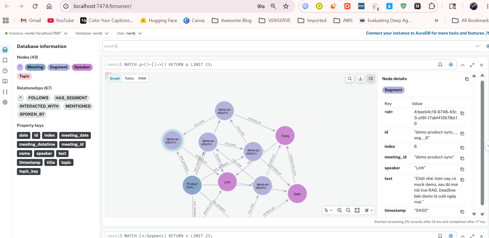
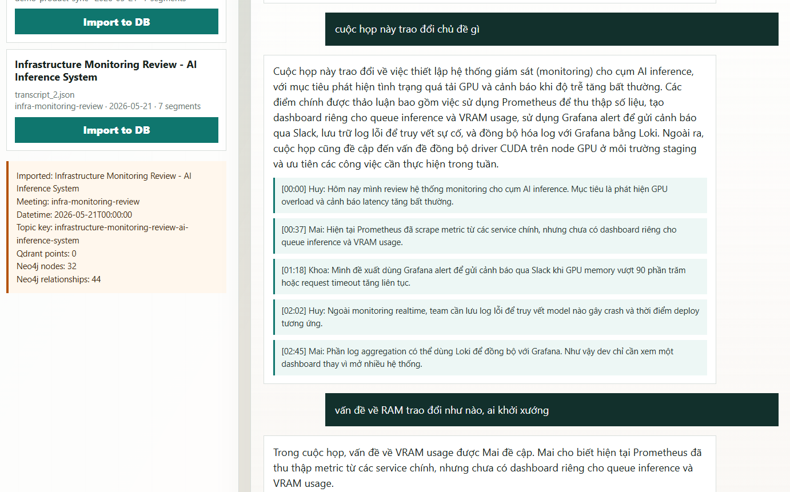

# Hackathon 2026 AI Meeting Core

Backend demo for an AI meeting analysis assistant. The application imports JSON transcripts from the `data/` directory, indexes transcript chunks in Qdrant, stores the meeting structure in Neo4j, and lets users ask questions about imported meetings through a simple web UI.





## Chat Pipeline Architecture



## Key Features

- Import meeting transcripts from local JSON files.
- Index transcript chunks into Qdrant with OpenAI embeddings for semantic retrieval.
- Store meetings, speakers, segments, topics, and interaction relationships in Neo4j.
- Ask questions about imported meetings.
- Always answer with a hybrid RAG flow: Qdrant semantic context plus Neo4j entity/graph context.
- Log retrieved Qdrant chunks and Neo4j context lines for backend debugging.
- Serve a single-page web UI at `/`.
- Include sample data in `data/transcript_1.json`, `data/transcript_2.json`, and `data/transcript_3.json`.

## Tech Stack

- Python 3.11+
- FastAPI
- LangChain, LangGraph
- OpenAI API
- Neo4j
- Qdrant
- Docker Compose
- uv

## Project Structure

```text
.
├── app/
│   ├── core/                 # Configuration, logging, and OpenAI client
│   ├── models/               # Pydantic models
│   ├── services/             # Import, chat, Neo4j, Qdrant, Graphiti
│   ├── utils/                # Transcript formatting and metadata helpers
│   └── main.py               # FastAPI app + UI HTML
├── data/                     # Sample transcript JSON files
├── docker-compose.yml        # Local Neo4j + Qdrant services
├── pyproject.toml            # Project metadata and dependencies
├── uv.lock                   # Locked dependency versions
└── .env.example              # Example environment variables
```

## Requirements

- Docker and Docker Compose
- Python 3.11 or later
- uv
- OpenAI API key

## Setup

1. Install dependencies:

```bash
uv sync
```

2. Create the local environment file:

```bash
cp .env.example .env
```

3. Update `OPENAI_API_KEY` in `.env`:

```env
OPENAI_API_KEY=sk-your-openai-key
OPENAI_MODEL=gpt-4o
OPENAI_EMBEDDING_MODEL=text-embedding-3-small

QDRANT_HOST=localhost
QDRANT_PORT=6333
QDRANT_COLLECTION=meeting_transcripts

NEO4J_URI=bolt://localhost:7687
NEO4J_USERNAME=neo4j
NEO4J_PASSWORD=password123
```

## Run Locally

1. Start Neo4j and Qdrant:

```bash
docker compose up -d
```

2. Run FastAPI:

```bash
uv run uvicorn app.main:app --reload
```

3. Open the application:

```text
http://localhost:8000
```

Neo4j Browser is available at:

```text
http://localhost:7474
```

Default credentials:

```text
username: neo4j
password: password123
```

## Usage

1. Open `http://localhost:8000`.
2. Select a transcript from the list on the left.
3. Click `Import to DB`.
4. After import completes, select the meeting from the dropdown on the right.
5. Type a question or use suggestion chips such as conclusions, assignments, risks, or deadlines.

## API

### `GET /`

Returns the demo web UI.

### `GET /api/transcripts`

Lists transcripts in the `data/` directory and meetings imported during the current runtime.

Example response:

```json
{
  "files": [
    {
      "filename": "transcript_1.json",
      "meeting_id": "demo-product-sync",
      "title": "Product Sync - AI Meeting Assistant",
      "meeting_date": "2026-05-21",
      "segments": 7
    }
  ],
  "imported": []
}
```

### `POST /api/import`

Imports a transcript into Qdrant and Neo4j.

Request:

```json
{
  "filename": "transcript_1.json"
}
```

Example response:

```json
{
  "meeting_id": "demo-product-sync",
  "title": "Product Sync - AI Meeting Assistant",
  "meeting_date": "2026-05-21",
  "meeting_datetime": "2026-05-21",
  "topic_key": "product-sync-ai-meeting-assistant",
  "qdrant_points": 7,
  "graph": {
    "backend": "neo4j",
    "meeting_id": "demo-product-sync",
    "nodes": 16,
    "relationships": 32,
    "nodes_created": 16
  }
}
```

### `POST /api/chat`

Asks a question about an imported meeting. Every chat request uses hybrid retrieval: Qdrant semantic search runs first, then Neo4j graph/entity retrieval runs, then both contexts are merged and sent to the answer LLM.

Request:

```json
{
  "meeting_id": "demo-product-sync",
  "question": "Who is responsible for what?",
  "chat_history": []
}
```

Example response:

```json
{
  "answer": "Trang is responsible for checking the ingest pipeline and graph components...",
  "sources": [
    {
      "speaker": "Linh",
      "timestamp": "02:05",
      "text": "This week's MVP needs a local demo...",
      "score": 1.0
    }
  ],
  "route_used": "hybrid"
}
```

## RAG Flow

The chat pipeline in `app/services/chat.py` is intentionally fixed to hybrid mode:

1. Convert chat history into LangChain messages.
2. Query Qdrant with the user question using OpenAI embeddings and `similarity_search_with_relevance_scores`.
3. Extract entities from the user question, including topic, speakers, and question type.
4. Query Neo4j with the extracted entities:
   - `topic + two speakers`: speaker interaction on that topic.
   - `topic`: segments connected to that topic.
   - no topic: all meeting segments as fallback.
5. Merge both sources into one prompt context:
   - `=== Qdrant Semantic Context ===`
   - `=== Neo4j Entity Context ===`
6. Ask the answer LLM to respond in Vietnamese.

The response `sources` field contains the Qdrant chunks returned by semantic retrieval. Neo4j context is logged on the backend and included in the final prompt context.

## Debug Logs

Application logs are configured in `app/core/logging.py` and enabled from `app/main.py`. When running the app with the default `LOG_LEVEL=INFO`, chat requests print backend retrieval details:

```text
CHAT QDRANT query_start meeting_id=... question='...'
CHAT QDRANT query_result meeting_id=... chunks=...
CHAT QDRANT chunk meeting_id=... index=... speaker=... timestamp=... score=... text='...'

CHAT NEO4J entity_extract_start meeting_id=... question='...'
CHAT NEO4J entities meeting_id=... topic=... speakers=[...] question_type=...
CHAT NEO4J query_result meeting_id=... query=... lines=... chars=...
CHAT NEO4J context_line meeting_id=... index=... text='...'
```

These logs are not shown in the UI; they are intended for debugging retrieval quality from the terminal running Uvicorn.

## Transcript Format

Transcript files are placed in the `data/` directory with the following format:

```json
{
  "transcript": {
    "meeting_id": "demo-product-sync",
    "title": "Product Sync - AI Meeting Assistant",
    "meeting_date": "2026-05-21",
    "topic": "AI Meeting Assistant",
    "segments": [
      {
        "speaker": "Linh",
        "timestamp": "00:00",
        "text": "Spoken content..."
      }
    ]
  }
}
```

Main fields:

- `meeting_id`: unique meeting identifier.
- `title`: display title.
- `meeting_date`: meeting date.
- `meeting_datetime`: meeting time in ISO-8601 format, if available.
- `topic`: stable topic used to link related meetings.
- `segments`: list of transcript turns containing `speaker`, `timestamp`, and `text`.

## Technical Notes

- `app/services/import_service.py` imports every transcript into both Qdrant and Neo4j. `qdrant_points` is the number of chunks indexed in Qdrant.
- `app/services/qdrant_service.py` builds overlapping speaker-turn chunks, embeds them with `OPENAI_EMBEDDING_MODEL`, and stores vectors plus metadata in Qdrant.
- `app/services/chat.py` always uses hybrid retrieval instead of asking a router model to choose a single retrieval path.
- Graphiti has a dedicated service in `app/services/graphiti_service.py`, but the current default path uses the direct Neo4j service.
- Imported meetings are stored in memory through the `_IMPORTED` variable, so they are lost when the app restarts.
- The import process calls OpenAI to extract topics per speaker, so `OPENAI_API_KEY` is required.

## Useful Commands

```bash
# Start local infrastructure
docker compose up -d

# Stop local infrastructure
docker compose down

# Run the development app
uv run uvicorn app.main:app --reload

# Run tests
uv run pytest
```
